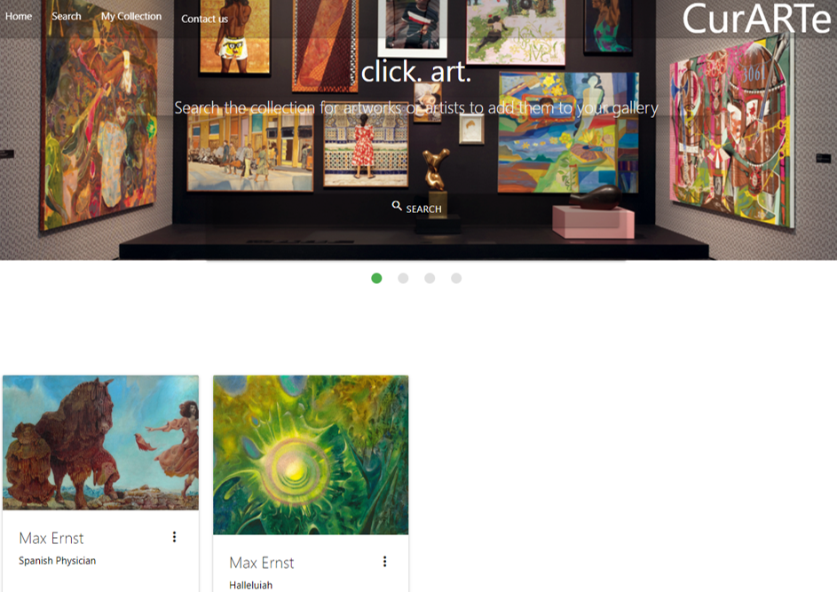

# curARTe

## Overview
curARTe is an application to research and store artworks from the Art Institute of Chicago's collection to display on a personal gallery wall. The artwork and quick research content will be stored in local storage to continue displaying after the page is closed. 

## Project Description
AS AN art and design enthusiast

I WANT a place to research and curate a personal collection of artworks
SO THAT I can display them and have easy access to research and visual representation of the artworks.

I WANT the artworks and research to be available in local storage
SO THAT the content will remain in place upon page refresh.

I WANT to be able to add and delete artworks and research
SO THAT my gallery wall will be responsive to my wants and needs for design and art purposes.

I WANT to be able to search for artworks by title, artist, date, color, and artwork type 
SO THAT I can design my gallery wall with themes I choose.

## Run and Install
The deployed site can be accessed [here](https://kitanablade.github.io/curarte/). A screenshot of the deployed site is shown below: 

## How to Use the Project
This application makes use of two server-side APIs - namely, the Art Institute of Chicago and mediawiki. Both APIs were used to initialize more general searches to supplement targeted queries to generate search responses. For example, the Art Institute of Chicago's API does not return images but can return enough information to generate an image upon query. A similar case is true of mediawiki which required search variables to be passed through to target smaller sections of text from the wiki page to be useful in the application. For both cases, our development team identified the necessary variables to pass through and concatenate into usable search parameters for a secondary query or to generate the desired content on the page. 

To use this project, a user can click the main search button on the home gallery page and use the dropdown list to choose a category to search within. The search modal will then return five matches according to the search term (see note below) that can be added to the home gallery page by the user as desired. The search modal will return both an image and wiki snippet of either the artwork or artist as available for the user to conduct some baseline research to help enhance their understanding of the artworks and artist they are including on their gallery wall. The gallery wall is stored in local storage to remain after page refresh. 

Note: Though this application is functioning, there are a few self-imposed limits the development team installed (such as a maximum search return of five artworks) to facilitate testing and limit potential bugs. As development continues, this restriction can be removed or updated as necessary.

## Credits
The curARTe team would like to extend credit to the following developers who contributed to the idea, design, creation, and implementation of the curARTe application:

Kit - kitanablade

Akshata - akshu3011

Nick - nickjestes

Kristen - kristensantee

## How to Contribute to the Project
This project is open for contribution but please initiate an issue for any large changes. 